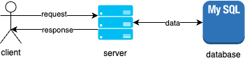

During my time as a software engineer at Binance, I was constantly challenged to look beneath abstraction layers in order to understand the behaviour of our software systems. One of the aspects that I have been researching on was database performance. The topic huge on its own, and it is impossible to cover everything within a blog post, so I narrowed down the content to focus on database and system design, which I think gives us a more approachable angle to understand why and how databases perform differently.

<!-- truncate -->

## Indexing

Database indexes improve the performance of database retrievals by trading off space complexity and write speeds. A separate data structure, such as a B+ tree or Hash Index, storeadditional information about the location of data points inside the table. The information helps the query engine quickly locate the position of the data in-memory or on-disk without searchingthrough every record in the table, avoiding an undesirable operation as it has linear time complexity. This additional data structure incurs extra memory cost, as well as reduce write speeds because of the extra data that needs to be managed. Therefore, indexes should be chosen carefully as it will incur additional and sometimes unintentional performance costs to other operations.

Some indexes may be implicitly defined on the table definition itself, for example, columns defined as PRIMARY KEY.

Indexes should be created on columns where it is often used inside SQL WHERE and ORDER BY clauses, MAX or MIN aggregation functions, GROUP BY and JOIN operations. For example:

```sql
SELECT order
FROM orders_table
WHERE order_id = ${orderId}
```

Performance of the above query can be improved by creating an index on the order_id column, avoiding a slow full-table scan.

It is also possible to create indexes on groups of columns (composite indexes) for queries with multiple clauses. For example:

```sql
SELECT order_id, order_status
FROM orders_table
WHERE order_id = ${orderId}
AND order_status = ${orderStatus}
ORDER BY order_date DESC
```

A composite index of (order_id, order_status, order_date) can be created to improve the speed of the above query by avoiding a costly file sort operation. As a bonus, queries that use (order_id) or (order_id, order_status) in the clauses can also take advantage of the performance of composite index.

To diagnose a query’s performance, we can use EXPLAIN or EXPLAIN ANALYZE to view the query plan. Some red flags include file sort, table joins, full-table scans; these queries should be scrutinized and redesigned if possible.

## Caching

Queries and their results can be cached in-memory, so when the same query is evaluated, the database does not need to recompute the data from the tables. This is useful especially for expensive and frequent queries, and tables where the data does not change very often. The database automatically invalidates the cache when table data is modified to avoid stale results.

## Normalization

Database normalization is a process of structuring a relational database with the goal of reducing data redundancy and improving data integrity. This is an important design step as proper normalization can prevent data anomalies while performing efficient insert, update, and delete operations. This process is important for write-heavy applications where data integrity is crucial, such as OLTP (transactional) systems.

The opposite process, called denormalization, can be useful to improve query performance by reducing database operations through strategic redundancy. This process helps improves read-heavy applications’ performance by simplifying queries through reducing table joins and full-table scans, and increasing index hits. This opposite process is important for OLAP (analytical) systems where database queries outnumber writes.

### Case Study: Instagram’s Justin Bieber Problem

Before denormalizing, the query for number of likes on a post looked something like this:

```sql
SELECT COUNT(*)
FROM likes_table
WHERE - - filter by post id
```

COUNT(*) operation has become a performance bottleneck due to the large size of the likes_table, so much so that when a celebrity with high follower count (i.e. Justin Bieber) creates a post, the database would not be able to cope with the number of read operations and eventually run out of resources, grinding to a halt.

The likes counter is eventually denormalized. After denormalizing, the query for number of likes on a post looked something like this:

```sql
SELECT num_likes
FROM posts_table
WHERE - - filter by post id
```

This query requires only an index lookup to retrieve the number of likes for a post, vastly improving the query speed and stabilizing the database service.

(There is more to the story, including Instagram’s use of memcache and Facebook’s data centers; omitted for brevity and relevance.)

Database normalization and denormalization are not mutually exclusive techniques! Both normalized and denormalized database can be used simultaneously to improve read and write workloads. An architectural pattern called Command and Query Responsibility Segregation (CQRS) separates read and write workloads to different databases, each database’s structure prioritizes a specific operation. As a downside, this pattern will increase the application’s complexity due to the need to frequently synchronize the databases, and cannot guarantee read-side’s immediate consistency.

## Sharding/Partitioning

One strategy to improve database performance is by sharding it. Sharding is a technique that splits the database into smaller, independent segments (shards) that can be distributed across multiple servers. This technique allows for multiple database servers to share workloads, which increases the capacity of the whole system to serve more requests.



For single database architecture as pictured above, all operations are done by one database instance. When the database grows large, the performance of the database will decrease due to CPU, RAM, and disk space constraints.

Below is an example of a sharded database architecture.


For each incoming request requiring a database operation, a shard key is computed, which determines which partition to insert or query data from. The derivation of a shard key is determined and designed according to the use case. For example, it can be based on a range of user id, or user id modulo the number of database shards. The selection and computation of a shard key is an important factor to consider as it directly impacts performance: a good shard key algorithm efficiently computes and evenly distributes keys to databases, which prevents hot (over-utilization) and cold (under-utilization) spots, leading to good database performance as the workload can be evenly shared. Read this for more details: https://planetscale.com/blog/types-of-sharding

Very importantly, the client usually does not concern itself with the computation of the shard key; this logic is abstracted away.

## Replication

Another strategy is to create duplicate copies of the database on different nodes in different locations. This provides redundancy by continuing to serving data even when some nodes are unavailable. It also improves performance by reducing the physical distance traveled by data between the database server and the client, improving the round-trip time (RTT) of requests.

Sharding and Replication are often used together to create resilient and performant database systems. The challenges associated with these strategies are increased infrastructure costs and system complexity, and increased maintenance needed to ensure the distributed databases are consistent.

## Summary

Database performance is a large topic and it will take time and hands-on production experience to fully understand. Nevertheless, we can develop an intuition to identify database performance issues and systematically think of solutions. Below are some important factors listed in order of cost-to-effectiveness ratio, with the most effective and least costly (effort/money/skill) factor to consider first.

1. Query design: can we write better queries? Hit index, reduce joins, reduce table scans, reduce sorting.
2. Database design: can we design better database tables? Create column indexes, cache queries, normalize/denormalize.
3. Configuration: what if the database server itself is the bottleneck? Increase page size, load more data into RAM, reduce disk I/O using symlinks.
4. System design: how about scaling out/decoupling reads from writes? Sharding/partitioning, replication, CQRS
5. Hardware: can we use faster hardware? CPU, RAM, disk/SSD...

**References:**

- https://instagram-engineering.com/instagration-pt-2-scaling-our-infrastructure-to-multiple-data-centers-5745cbad7834
- https://www.loadview-testing.com/zh-hans/blog/5-%E4%B8%AA%E6%9C%80%E5%B8%B8%E8%A7%81%E7%9A%84%E6%95%B0%E6%8D%AE%E5%BA%93%E6%80%A7%E8%83%BD%E9%97%AE%E9%A2%98%E5%92%8C%E4%BF%AE%E5%A4%8D/
- https://dev.mysql.com/doc/refman/5.7/en/optimization.html
- https://www.youtube.com/watch?v=GaYdgWsbRo8
